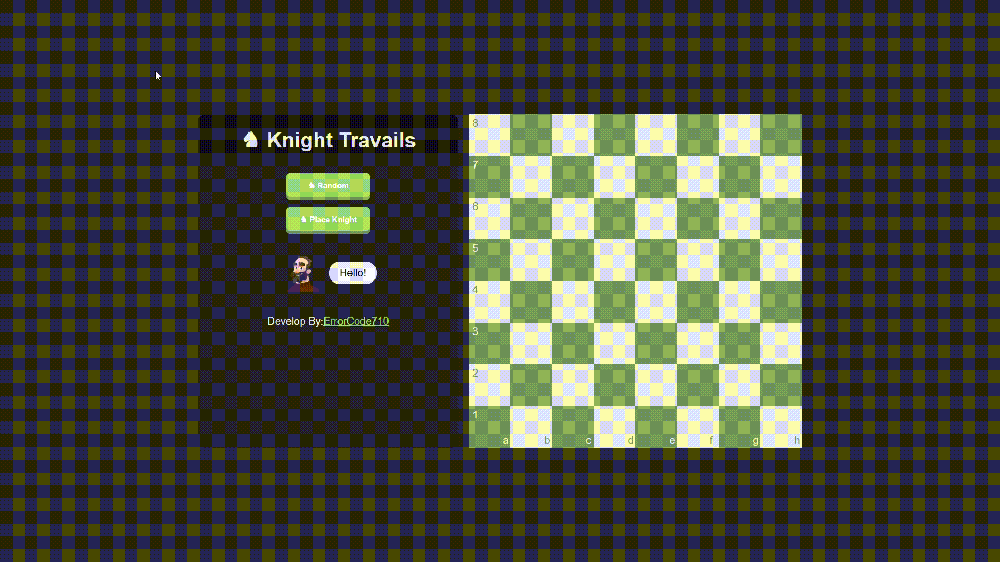

# ♞ Knight Travails

**Knight Travails** is a visualization project that demonstrates the shortest path a knight takes from one square to another on a standard 8x8 chessboard using **Breadth-First Search (BFS)**. It's a great way to learn pathfinding algorithms and coordinate-based logic in JavaScript.

---

## 🔗 Live Demo

🌐 **[Click here to view the demo](https://knighttravails.netlify.app/)**  
📸 

> ⚠️ _Best viewed on desktop for full visualization._

---

## 💡 Features

- Interactive UI to select the **start** and **end** positions
- BFS algorithm to find the **shortest path**
- Real-time knight animation as it moves across the board
- Coordinate tracking and path display
- Clean, responsive design (mobile layout: under improvement)

---

## 🚀 Technologies Used

- Vanilla **JavaScript**
- **HTML** + **CSS Grid**
- Algorithm: **Breadth-First Search (BFS)**

---

## ⚙️ How It Works

The knight's movement follows the standard "L-shape" rule from chess. Given a start and end coordinate, the algorithm computes the shortest sequence of valid knight moves using BFS, and animates each step on the board.

## 🧠 What I Learned

- How to use BFS for finding the shortest path
- Finding The Coordinates
- Recursion
